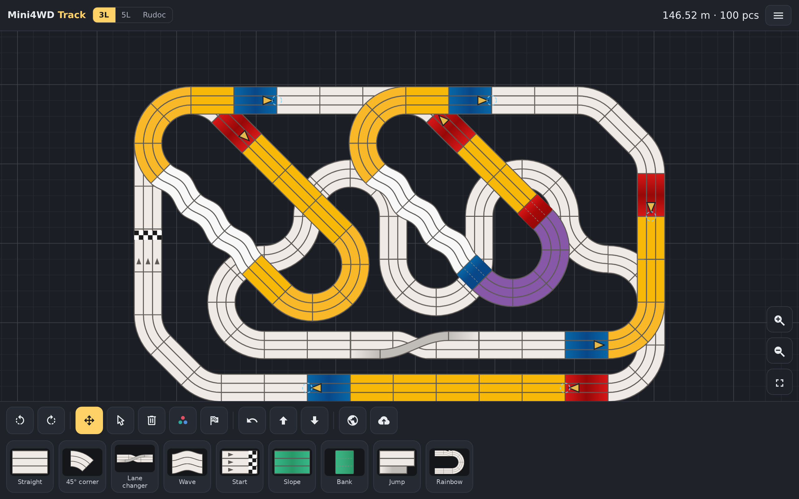
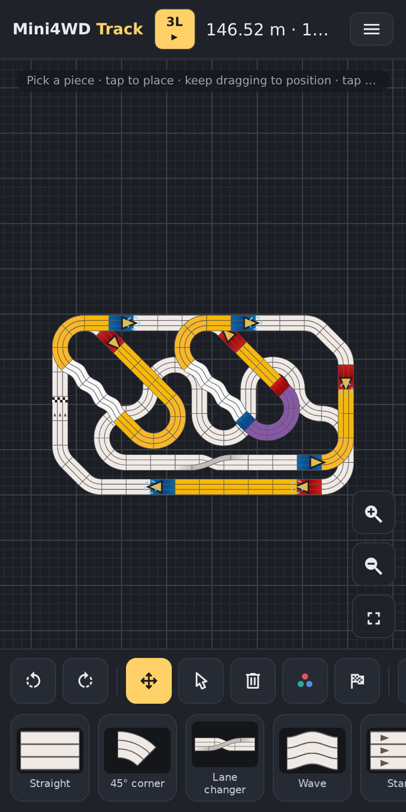

# Mini4WD Track Editor

<p align="center">
  
  
</p>

Design Mini4WD circuits on your phone. The editor is a plain static
site (no build step, no frameworks); open it and lay track.

## Features

- **Closing the loop.** Leave a gap in the circuit, select the two open
  ends, and tap Complete. The editor finds the shortest run of straights
  and corners that closes the loop and places it. If the gap is blocked,
  it offers to clear the pieces in the way first, then closes.
- **Publishing and the gallery.** A track stays on your device until you
  name and publish it; after that every edit saves automatically. The
  gallery lists all published tracks. Sort by last update, length, lane
  count, footprint, or stars; narrow the list by length range, lanes,
  footprint, or part counts (straights, slopes, corners); show only
  finished circuits or tracks saved on this device (Mine). There are no
  accounts: starring a track or opening someone else's to edit works
  with a tap.
- **Version history.** Every save of a published track keeps the
  previous version. The History list shows them all and any can be
  restored with a tap. Copy makes your own version of a track (labelled
  "based on" the original) and leaves the original alone.
- **Placing pieces.** Pick a piece, tap the canvas, and it drops in and
  snaps to nearby track ends (green dots mark the joints). You can hold
  and drag it into position before letting go.
- **Moving things.** Drag pieces individually or select a group, which
  then snaps as a unit. A connected piece rotates around its joint, a
  selection rotates around its center. Everything can be undone.
- **Elevation.** Height changes in 10 mm steps. Slopes carry the level
  across, bridges over lower track are drawn see-through, and a warning
  appears when the clearance drops under 75 mm.
- **Track check.** The save button is a live health check: a green ring
  means the circuit is complete and consistent, a red one means problems
  (dangling ends, kinked joints), listed when tapped. Incomplete tracks
  can still be published and are marked Work-in-Progress.
- **Share links.** The whole track is encoded in the URL, so a link is
  all it takes to hand someone your circuit.
- **Phones first.** Two-finger pan and pinch zoom, a bottom toolbar, a
  scrollable palette, safe-area support. Desktop gets the same features
  on the keyboard (1-9 pieces, Q/W/E tools, Z/X rotate, R undo, F fit,
  Space pan).
- **Two track systems.** Regulation 3-lane and 5-lane Tamiya pieces
  (11.5 cm lanes, official lap lengths) and rucdoc 1/2/3-lane
  3D-printed pieces. All sprites are vector art drawn on the same grid,
  so mixed systems line up at the joints.

## Running it

```sh
node serve.js        # editor only (port 3000)
node server.js       # editor + track storage (sqlite by default)
```

Self-hosting: `docker compose up` runs the published image
(`ghcr.io/lenaxia/mini4wd-track-editor`, built from `v*` tags, amd64 +
arm64) with a sqlite volume; add `--profile postgres` for postgres.
The server keeps each track as an opaque document and indexes the
facets used in search (length, lanes, footprint, piece counts,
completeness, stars).

Track format: `Name;x;y;angle;color;z#…` (1 px = 1 cm, z in mm);
legacy tracks import unchanged.

## Development
Module map: `pieces.js` catalog · `geometry.js` snap math · `track.js` codec ·
`validate.js` validator · `store.js` model · `solver.js` loop-closing search · `render.js` canvas · `input.js`
gestures · `ui.js`/`gallery.js` DOM · `tooltip.js` position-aware tips ·
`storage.js`/`cache.js`/`assets.js`
persistence+assets · `art.js`/`icons.js` fallback art and icons · `main.js`
boot. `server.js`+`lib/` serve and store; `tools/` generate and verify.

```sh
npm test             # unit (node --test, zero deps)
npm run test:e2e     # Playwright suite
```

`tools/render-pipeline/` regenerates every sprite from the catalog
(`INVARIANTS.md` is the art contract); `tools/verify/` checks lane
geometry and golden rasters. Pure modules run under plain node, which is
also how the server validates tracks. CI runs the suites, a live-postgres
conformance check, and a real docker build-and-boot smoke on every PR.

## AI use

This project is built with AI coding agents under human direction.
`README-LLM.md` holds the rules the agents work under, `docs/worklogs/`
records each change and the decisions behind it, and every pull request
is reviewed by an automated AI reviewer before merge.

## Credits

- **Pimentoso (Michele Ferri)**: the track format, piece catalog, and
  snapping algorithm derive from his MIT-licensed Mini4WD Online Track
  Editor (© 2016); notices preserved in source headers.
- **rucdoc**: the 1/2/3-lane 3D-printed track system, MIT (c) rucdoc;
  sprites are original vector redraws from his published dimensions.
- **Tamiya**: "Mini4WD" and track piece designs are property of Tamiya
  inc. Independent fan tool.
- Icons: [Material Design Icons](https://github.com/Templarian/MaterialDesign-SVG),
  MIT (© 2014-2025 Austin Andrews), vendored inline.
